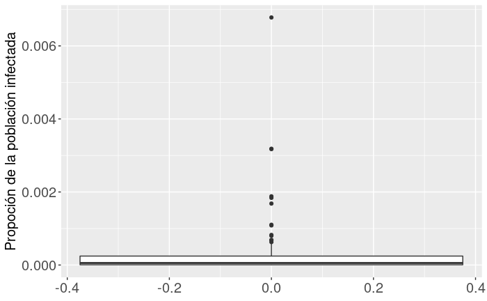
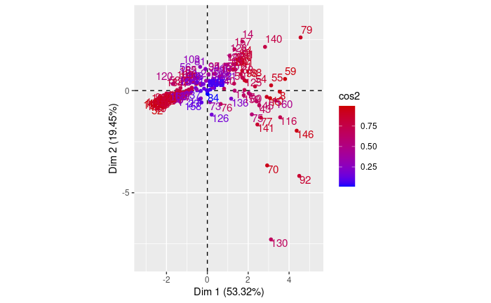

```{r setup, include=FALSE}
knitr::opts_chunk$set(echo = TRUE)
```


## Introducción

* Aplicamos ACP a una base de datos sobre variables económicas y sanitarias en el contexto del COVID-19. 

* Se tuvo como referencia el artículo **Economic Policy Responses to a Pandemic: Developing the COVID-19 Economic Stimulus Index** (Ceyhun Elgin, Gokce Basbug, Abdullah Yalaman; 2020). Crean un Índice de Estímulo Económico (*CESI_INDEX*) que buscamos replicar.

* Los autores utilizan el Índice como variable explicada en un modelo lineal, nosotros la pretendemos utilizar en un segundo ACP.

* Datos al 31 de marzo de 2020, fuente: FMI principalmente.

## Variables

* Se cuenta con datos para 166 observaciones (países) y 14 variables. 

* Las variables empleadas para replicar el *CESI_INDEX*:

  * *fiscal*: paquete de políticas fiscales adoptadas, representado como porcentaje del PBI

  * *ratecut*: representa el porcentaje que fue recortado de la tasa de interés en relación a la de febrero de 2020

  * *macrofin*: tamaño del paquete de medidas macrofinancieras, expresado como porcentaje del PBI

  * *bopgdp*: políticas de balanza de pago, expresadas como porcentaje del PBI

  * *othermonetary*: variable indicadora que indica si en el país se tomaron otras medidas monetarias

  * *otherbop*: variable indicadora que indica si en el país se tomaron otras medidas de políticas de balanza de pago.

## Variables empleadas en el ACP posterior:

  * *medage*: edad mediana en el país

  * *infectionrate*: tasa de infección, representa la proporción de la población total infectada de COVID-19

  * *hospitalbed*: camas de hospital por cada 1000 personas

  * *healthexp*: gastos en salud, expresados como porcentaje del PBI

  * *gdppercap*: PBI per cápita del país en dólares a niveles de 2010

  * *CESI_INDEX*: índice de estímulo económico (construido por los autores utilizando análisis de componentes principles)


## Variables no consideradas en el análisis final

* *totalcases*: cantidad de casos totales de COVID-19

* *stringency*: índice de rigurosidad de respuesta gubernamental (desarrollado por Hale y Webster en 2020)


* *denspob*: densidad poblacional del país, medida como cantidad de personas por kilómetro cuadrado de área terrestre.

## Datos Faltantes

\begin{table}[H]
\centering
\begin{tabular}{rll}
  \hline
 & Variable & Datos faltantes \\ 
  \hline
1 & totalcases & 15 \\ 
  2 & medage & 20 \\ 
  3 & gdppercap & 23 \\ 
  4 & healthexp & 20 \\ 
  5 & hospitalbed & 19 \\ 
  6 & stringency & 93 \\ 
  7 & infectionrate & 22 \\ 
   \hline
\end{tabular}
\caption{Tabla de cantidad de observaciones faltables para las variables.} 
\end{table}

## Correlaciones entre las variables

* Se destacan por ser altas las correlaciones entre: 
  * *gdppercap* y *fiscal*: 0.6 
  * *medage* y *gdppercap*:  0.6 
  * *medage* y *hospitalbed*: 0.71. 
  
* Al realizar el análisis de componentes principales se buscará obtener un nuevo conjunto de variables incorrelacionadas entre si y posiblemente reducir su número con respecto al conjunto original.

## Principales resultados del análisis descriptivo

* Argelia toma el valor más alto de *bopgdp* (6%, el país que le sigue es Croacia con 2.94%, para la mayoría de los países es 0%) y el más bajo de *fiscal* (-7.2% ) 

* 21 observaciones con valores altos de *ratecut*, entre estas observaciones se encuentran Reino Unido, Noruega, Croacia, Nueva Zelanda y Estados Unidos, siendo este último el único país que tuvo una reducción del 100 de su tasa de interés. La mediana de *ratecut* es 0%, 95 países toman este valor.

* *macrofin* cuenta con un conjunto de observaciones atípicas, destacándose en particular dos de ellas que se alejan incluso más que el resto, tomando valores próximos a 25 (Baréin y Oman), siendo que las siguientes observaciones más altas están en torno a 15. 102 países toman el valor 0 de esta variable.

* En *gdppercap* hay bastante dispersión. Hay un conjunto de países con valores atípicamente altos, siendo la 101 observación que toma el mayor valor es Luxemburgo, con un PBI per cápita de 110742.

## Principales resultados del análisis descriptivo

* *medage* presenta gran simetría, una media de  31.52  y no cuenta con atípicos

* En *healthexp*, se destaca una la observación correspondiente a Estados Unidos con un gasto en salud del 17.07% del PBI, casi el doble que el país que le sigue.

*  Japón es el país que toma el mayor valor de *hospitalbed* con 13.4. 


## Boxplot de *infectionrate*




## Principales resultados del análisis descriptivo

* *infectionrate* cuenta una gran acumulación de tasas de infección en torno a valores próximos a 0, y un 75% de las tasas son menores a 0,025% (que representa un caso por cada 4000 habitantes aproximadamente). 

* Se destaca especialmente San Marino, con una tasa de infección del 0,68% que representa un caso por cada 150 habitantes aproximadamente.  

## Construcción del Índice de Estímulo Económico 

* Se usa FactomineR para recrear el Índice que los autores del artículo de referencia emplearon.

* Se pudo comprobar que el Índice de Estímulo Económico de los países que se obtuvo realizando el ACP y definiéndolo como los valores de la primera componente principal es equivalente al obtenido por los autores. Esto nos lleva a pensar que el procedimiento de imputación de valores faltantes fue el mismo, la imputación de la media de las variables.

* Al realizar el ACP observamos que la primera componente principal logra explicar un 27.13% de la variabilidad total de la nube de puntos, la segunda un 19.76% y la tercera un 18.04%.

* El porcentaje explicado explicado por la primera componente es bajo pero acorde al uso que le dan los autores.


## Coordenadas de las variables en el primer eje

\begin{table}[H]
\centering
\begin{tabular}{lr}
  \hline
Variable & Correlación \\ 
  \hline
fiscal & 0.74 \\ 
  ratecut & 0.50 \\ 
  macrofin & 0.71 \\ 
  bopgdp & -0.21 \\ 
  othermonetary & 0.50 \\ 
  otherbop & -0.21 \\ 
   \hline
\end{tabular}
\caption{Correlación de cada variable con el índice de estímulo económico.} 
\end{table}

## ACP considerando el Índice de Estímulo Económico

* Como primer paso, creamos a partir de *infectionrate* la variable *noinfectionrate*, para indicar la proporción de habitantes del país no infectados en lugar de los infectados.

* El conjunto de variables empleado en este análisis esta conformado por *medage*, *gdppercap*, *healthexp*, *hospitalbed*, *noinfectionrate*. 

* La variable *CESI_INDEX*, el índice de estímulo económico obtenido a partir del ACP es utilizado como variable suplementaria en el análisis, y tampoco se incluyen las variables empleadas para construirlo al ser la intención utilizar el índice como su representante. 

* También es excluida la variable que indica la cantidad de casos totales de COVID-19 (*totalcases*)

## ACP considerando Índice de Estímulo Económico

\begin{table}[H]
\centering
\begin{tabular}{rrrr}
  \hline
 & Valor propio & \% de varianza & \% acumulado de varianza \\ 
  \hline
comp 1 & 2.67 & 53.32 & 53.32 \\ 
  comp 2 & 0.97 & 19.45 & 72.77 \\ 
  comp 3 & 0.67 & 13.49 & 86.26 \\ 
  comp 4 & 0.48 & 9.56 & 95.81 \\ 
  comp 5 & 0.21 & 4.19 & 100.00 \\ 
   \hline
\end{tabular}
\caption{Valores propios asociados a las componentes principales y porcentajes de inercia de cada uno.} 
\end{table}

## Perspectiva de la nube de individuos



## Perspectiva de la nube de individuos

* Es deseable que ninguno de los individuos sea especialmente influyente a la hora de generar los componentes principales. A primera vista la Figura 2 indicaría que esta situación no se da.

* En el primer eje tiende a dar mayores valores a países de mayor desarrollo económico (que se corresponden con valores mayores en el conjunto de variables que se usaron para caracterizarlos). 

* Mientras tanto el segundo eje tiende a dar valores mayores a países con menor tasa de infección.


## Perspectiva de la nube de individuos

\begin{table}[H]
\centering
\begin{tabular}{rlrr}
  \hline
 & País & cos2\_plano & norma \\ 
  \hline
130 & San Marino & 0.67 & 9.69 \\ 
  92 & Luxembourg & 0.85 & 6.64 \\ 
  79 & Japan & 0.90 & 5.55 \\ 
  160 & United States & 0.47 & 4.94 \\ 
  146 & Switzerland & 0.95 & 4.92 \\ 
  70 & Iceland & 0.94 & 4.83 \\ 
  116 & Norway & 0.73 & 4.46 \\ 
  140 & South Korea & 0.77 & 4.05 \\ 
  59 & Germany & 0.97 & 3.91 \\ 
  14 & Belarus & 0.64 & 3.69 \\ 
   \hline
\end{tabular}
\caption{Observaciones con las 10 mayores normas y $cos^2(\theta)$ .}
\end{table}

San Marino es una observación influyente, al considerarla como complementaria se gana un 4% de inercia total explicada. Estados Unidos tiene un bajo $cos^2(\theta)$ pero no es influyente.

## Perspectiva de la nube de individuos

\begin{table}[H]
\centering
\begin{tabular}{rlrr}
  \hline
 & País & cos2\_plano & norma \\ 
  \hline
84 & Kuwait & 0.01 & 1.64 \\ 
  10 & Bahamas & 0.06 & 0.65 \\ 
  21 & Botswana & 0.06 & 0.00 \\ 
  26 & Burundi & 0.06 & 0.00 \\ 
  27 & Cabo Verde & 0.06 & 0.00 \\ 
  36 & Congo, R & 0.06 & 0.00 \\ 
  38 & Cote Ivory & 0.06 & 0.00 \\ 
  45 & Ecuador & 0.06 & 0.00 \\ 
  51 & Eswatini & 0.06 & 0.00 \\ 
  64 & Guinea Bissau & 0.06 & 0.00 \\ 
   \hline
\end{tabular}
\caption{Observaciones con los 10 menores $cos^2(\theta)$ y sus normas.} 
\end{table}

Se destaca que practicamente todos son países en vías de desarrollo. No obstante, todos estos países se encuentran muy cercanos al baricentro, por lo que su influencia es limitada.
